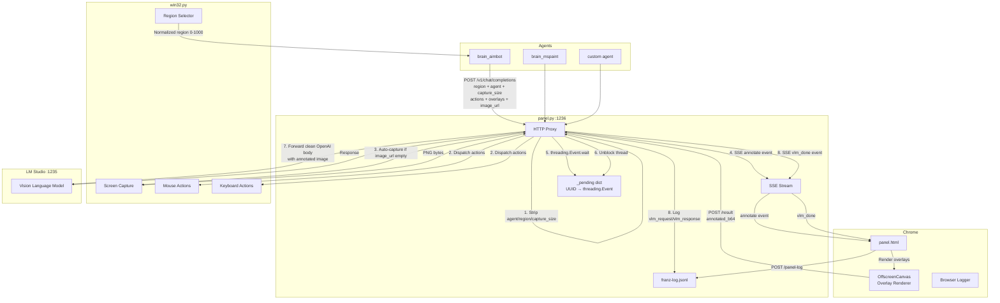
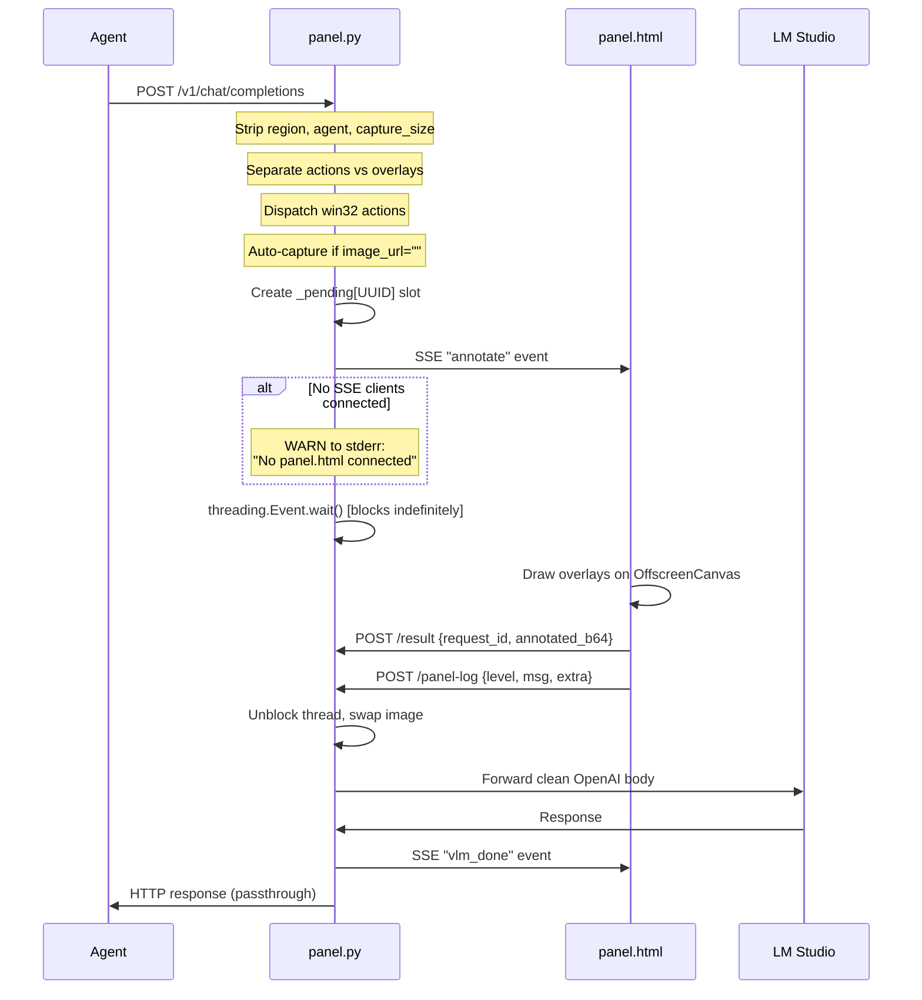
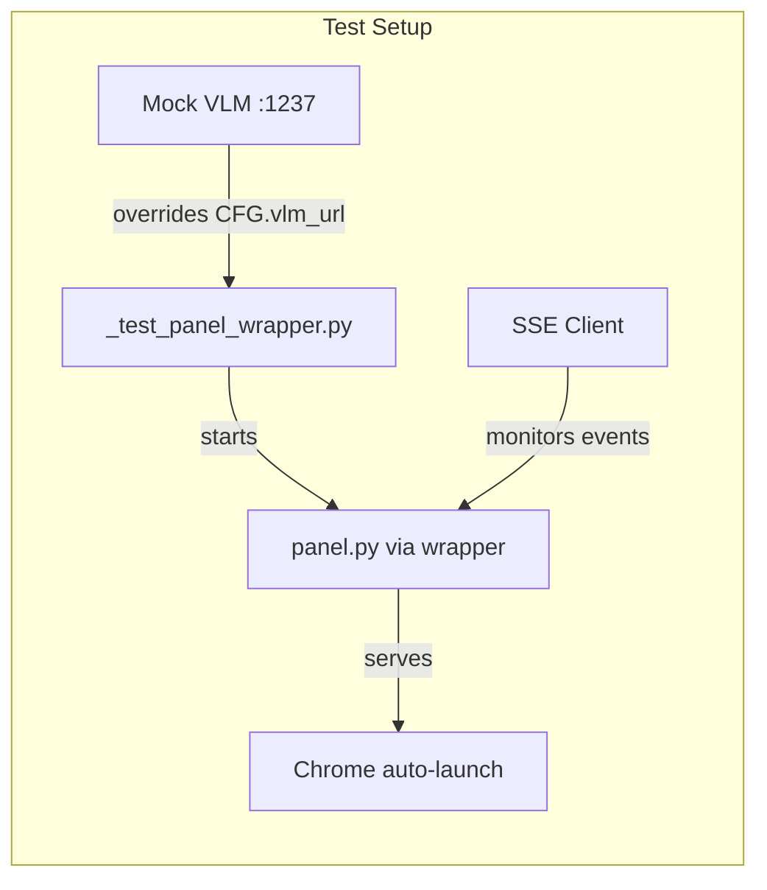

# Franz Swarm

Autonomous computer-control agent system for Windows 11. Pure Python 3.13, stdlib only, zero pip dependencies.

Franz Swarm connects AI vision models to physical desktop automation through a browser-based annotation pipeline. Agents send screenshots and action commands through a local proxy server, which routes images through Chrome for overlay rendering before forwarding to an LLM backend.

## Architecture

## Request Lifecycle

## Files

| File | Role |
|------|------|
| `panel.py` | ThreadingHTTPServer on :1236. Proxy between agents and VLM. Strips Franz-specific fields, dispatches win32 actions, manages SSE annotation pipeline, logs everything. |
| `panel.html` | Chrome-only dark UI. Receives SSE events, renders overlays via OffscreenCanvas, posts annotated images back. Sends browser-side logs to /panel-log. |
| `win32.py` | Pure ctypes CLI. Screen capture, mouse/keyboard simulation, interactive region selector. All coordinates normalized 0-1000, DPI-aware. |
| `brain_aimbot_new.py` | Head detection agent. Infinite loop sending frames with circle+crosshair overlays from prior detections. |
| `brain_mspaint_new.py` | MS Paint automation agent. Fixed recursive action sequence with drags, clicks, scrolls. |

## Coordinate System

All positions use a normalized 0-1000 coordinate space mapped to screen pixels. The region selector produces `x1,y1,x2,y2` in this space. Actions and overlays reference positions within the selected region.

The tandem selector pattern (used by agents at startup) runs `select_region` twice:
1. First call selects the capture region
2. Second call extracts a horizontal span to calculate the screenshot resize scale factor: `scale = (x2 - x1) / 1000`

## Critical Design Facts

- `threading.Event.wait()` has **no timeout** — requests block until Chrome posts `/result`
- Chrome re-encodes PNG through OffscreenCanvas even with zero overlays — byte equality always fails between raw and annotated images
- `franz-log.jsonl` is held open by FileHandler — wait for process termination before renaming
- `panel.py` is stateless generic plumbing — no fallbacks, no timeouts, no safety nets by design
- Each concurrent request gets a unique UUID and independent `threading.Event` slot
- The `_pending` slot is created **before** the SSE push — this is race-safe
- If no SSE clients are connected when a request arrives, a warning prints to stderr with agent name and request_id

---

# Test Suite

`test_autonomous.py` is a fully autonomous test suite with exactly two human-in-the-loop pauses (tandem region selections). It validates every layer of the system from raw pixel encoding to full pipeline round-trips.

## Test Infrastructure

The test suite manages its own lifecycle:

- **Mock VLM** runs on port 1237, separate from LM Studio on 1235. A generated wrapper script overrides `panel.py`'s `CFG.vlm_url` to point at the mock.
- **Chrome warmup** after every panel restart ensures the browser's SSE `EventSource` has reconnected before tests fire requests.
- **Mock VLM request capture** stores the last received request body for inspection, enabling tests to verify what panel.py forwards (and what it strips).

## Phase Map

### Phase 0: Setup Validation

Verifies the foundational infrastructure is operational before any functional tests run.

| Test | What It Validates | Development Impact |
|------|-------------------|-------------------|
| `panel_alive` | Panel subprocess did not crash on startup | Any import error, syntax error, or config issue in panel.py |
| `panel_ready` | GET /ready returns 200 | HTTP server binding, port conflicts, server thread startup |
| `sse_connected` | SSE EventSource receives "connected" event | SSE endpoint handler, event formatting, connection lifecycle |
| `panel_html_served` | GET / returns panel.html with correct title | File path resolution, HTML serving, PANEL_HTML constant |
| `404_path` | Unknown paths return 404 JSON | Router completeness, default handler |
| `panel_log_endpoint` | POST /panel-log returns 200 | Browser logging endpoint, JSON parsing, logger integration |

**If these fail:** The system is fundamentally broken. No other tests can run. Exit code 2 (fatal setup error).

### Phase 1: win32 Capture

Validates the screen capture pipeline from raw pixel grab through PNG encoding.

| Test | What It Validates | Development Impact |
|------|-------------------|-------------------|
| `capture_no_region` | Full-screen capture resized to 64x64 | BitBlt, StretchBlt, BGRA-to-PNG encoding, dimension handling |
| `capture_with_region` | Region-cropped capture at 32x32 | `_norm_region_to_pixels`, `_crop_bgra`, region parsing |
| `capture_full_resolution` | Capture at native resolution (width=0, height=0) | No-resize code path, screen metrics |
| `capture_png_header` | PNG has valid signature, IHDR chunk | `_bgra_to_png` structural correctness |
| `synthetic_png_roundtrip` | Generate solid-color PNG, decode it, verify pixel values | End-to-end PNG codec correctness, test infrastructure self-check |
| `synthetic_checkerboard_decode` | Checkerboard pattern survives encode/decode with exact pixel counts | PNG filter reconstruction (filters 0-4), alternating pixel patterns |
| `synthetic_gradient_decode` | Gradient image has correct corner pixel values | Sub-pixel accuracy in encode/decode, filter interaction with gradients |

**If `synthetic_*` tests fail:** The test suite's own PNG decoder is broken. All Phase 6 overlay pixel analysis becomes unreliable. Fix the decoder before trusting overlay tests.

**If `capture_*` tests fail:** Agents cannot see the screen. The entire system is non-functional.

### Phase 2: Mouse Actions

Uses the human-selected mouse region. Validates every mouse command in win32.py.

| Test | What It Validates | Development Impact |
|------|-------------------|-------------------|
| `click` | Click at normalized 500,500, verify cursor position | `_do_click`, `_resolve_screen_pos`, `SetCursorPos`, `mouse_event` |
| `double_click` | Double-click at 300,300, verify cursor | `_do_double_click`, inter-click timing |
| `right_click` | Right-click at 700,700, dismiss context menu | `_do_right_click`, RIGHT_DOWN/RIGHT_UP events |
| `drag` | Drag from 200,200 to 800,800, verify end position | `_do_drag`, step interpolation, mouse down/move/up sequence |
| `scroll_up` | Scroll up 3 clicks at 500,500 | `_do_scroll`, MOUSE_WHEEL with positive delta |
| `scroll_down` | Scroll down 3 clicks at 500,500 | `_do_scroll`, MOUSE_WHEEL with negative delta |
| `cursor_pos_roundtrip` | Click at 250,750, read back normalized coords within tolerance | `_screen_pixel_to_norm` inverse of `_norm_to_screen_pixel`, round-trip precision |
| `tandem_region_in_json` | Send chat completion with tandem-selected region and capture_size | Region/capture_size flow from selector through to VLM request |
| `tandem_capture_size_values` | Capture size from tandem selection is positive and reasonable | Scale calculation: `(x2-x1)/1000` produces valid dimensions |
| `tandem_region_format` | Region string has 4 comma-separated ints in 0-1000, x2>x1, y2>y1 | `select_region` output format, normalization correctness |

**If `cursor_pos_roundtrip` fails with values far off:** The normalized coordinate mapping has a bug. This affects every agent's ability to target UI elements.

**If `tandem_*` tests fail:** The double-selector pattern used by all agents at startup is broken. Agents will capture at wrong resolutions or target wrong screen areas.

### Phase 3: Keyboard Actions

Uses the human-selected keyboard region (should target a text editor).

| Test | What It Validates | Development Impact |
|------|-------------------|-------------------|
| `type_text` | Type "hello franz" into focused window | `_do_type_text`, VkKeyScanW mapping, shift/ctrl/alt modifier handling |
| `press_key_enter` | Press Enter key | `_do_press_key`, VK_MAP lookup, keybd_event |
| `press_key_backspace` | Press Backspace key | Extended key handling for navigation keys |
| `hotkey_ctrl_a` | Ctrl+A hotkey | `_do_hotkey`, modifier key sequencing (press order, release reverse order) |
| `hotkey_ctrl_z` | Ctrl+Z hotkey | Same mechanism, different key combo |
| `press_key_escape` | Press Escape key | VK_ESCAPE mapping |
| `type_special_chars` | Type "Test123!@#" | Shift-required characters via VkKeyScanW bit flags |
| `keyboard_tandem_region_in_json` | Chat completion with keyboard tandem region/capture_size | Same as mouse tandem but for the keyboard selection |
| `keyboard_tandem_values` | Keyboard tandem capture_size positive, region format valid | Validates both selections independently |

**If `type_special_chars` fails:** The shift-detection logic in `_do_type_text` is broken. Agents that type passwords, URLs, or code will produce wrong characters.

**If `hotkey_*` fails:** Agents cannot use keyboard shortcuts. Copy/paste, undo, select-all — all break.

### Phase 4: Automated select_region

Tests the interactive region selector without human interaction by using daemon threads to send synthetic input events.

| Test | What It Validates | Development Impact |
|------|-------------------|-------------------|
| `select_region_esc` | ESC produces exit code 2, empty stdout | Cancel path, `WM_KEYDOWN` VK_ESCAPE handler, `PostQuitMessage` |
| `select_region_right_click` | Right-click produces exit code 0, empty stdout | Skip path, `WM_RBUTTONDOWN` handler |
| `tandem_esc_first_cancels` | ESC on first selector returns empty region, no second selector runs | Agent startup abort behavior |
| `tandem_right_click_both` | Right-click through both selectors produces empty region + default capture size | Agent startup skip behavior, default 640x640 fallback |

**If `select_region_esc` fails:** Users cannot cancel the selector overlay. The fullscreen window may become stuck.

**If `tandem_*` fails:** The two-step startup sequence used by brain scripts has a logic error in how it handles cancellation or skipping.

### Phase 5: Panel SSE Pipeline

Tests the full annotation cycle: request in, SSE out, Chrome renders, result back, VLM forward, response out.

| Test | What It Validates | Development Impact |
|------|-------------------|-------------------|
| `annotate_cycle` | Complete round-trip with synthetic image, non-empty VLM response | The entire pipeline end-to-end. If this breaks, nothing works. |
| `annotate_with_overlays` | Cycle with a fill overlay attached | Overlay separation from actions, SSE overlay delivery |
| `annotate_with_action_dispatch` | Cycle with a click action, generates `action_dispatched` log entry | Action extraction from message content, `_dispatch_action` routing |
| `result_unknown_request_id` | POST /result with fake UUID returns 404 | `_pending` dict lookup, error handling for stale/invalid callbacks |
| `vlm_done_event` | SSE stream receives both "annotate" and "vlm_done" with correct agent/model/request_id | SSE event payload integrity, field propagation through pipeline |
| `empty_image_url_capture` | Empty `image_url` triggers auto-capture via win32.py | The `url == ""` detection path, subprocess capture invocation |
| `capture_size_forwarded` | Custom capture_size in request reaches the pipeline | `capture_size` extraction and usage in capture subprocess |
| `region_stripped_from_vlm_body` | `region`, `agent`, `capture_size` are removed before forwarding to VLM | `req_body.pop()` calls. If these leak through, VLM receives invalid OpenAI schema. |

**If `annotate_cycle` fails:** The core pipeline is broken. Check: Is Chrome connected? Is the mock VLM running? Is the SSE endpoint working?

**If `region_stripped_from_vlm_body` fails:** The VLM backend receives non-standard fields. Some VLM backends will reject the request or behave unexpectedly.

**If `result_unknown_request_id` fails:** A bug in `/result` error handling. Could cause silent failures when Chrome posts late or duplicate results.

### Phase 6: Overlay Rendering Correctness

Validates that Chrome's OffscreenCanvas correctly renders overlays by analyzing pixel data in annotated images.

| Test | What It Validates | Development Impact |
|------|-------------------|-------------------|
| `fill_overlay_changes_pixels` | Full-screen red fill over black image produces red pixels | `drawPolygonOn()` fill path, OffscreenCanvas compositing |
| `stroke_overlay_changes_pixels` | Red stroke rectangle produces red pixels along edges | `drawPolygonOn()` stroke path, lineWidth, lineJoin, lineCap |
| `no_overlay_pixel_preservation` | No overlay = zero red pixels (even though bytes differ due to re-encoding) | Confirms re-encoding does not introduce color artifacts |
| `fill_vs_no_overlay_red_delta` | Red pixel count with fill minus without fill exceeds threshold | Proves overlay rendering is strictly additive, not a re-encoding artifact |

**If `fill_overlay_changes_pixels` fails but `annotate_cycle` passes:** Chrome is connected but OffscreenCanvas rendering is broken. Check browser console for canvas API errors.

**If `no_overlay_pixel_preservation` fails with red pixels > 0:** The PNG decoder or red pixel detection has a false positive. Or Chrome is injecting unexpected color shifts.

**If `fill_vs_no_overlay_red_delta` fails:** The delta test is the most reliable overlay proof. If this fails, overlays may not be rendering at all, and agents receive unmodified images.

### Phase 7: Concurrent Request Isolation

Verifies that simultaneous requests from different agents do not interfere with each other.

| Test | What It Validates | Development Impact |
|------|-------------------|-------------------|
| `concurrent_agents` | 3 simultaneous requests with distinct agents all return 200 | Thread safety of `_pending` dict, SSE fan-out, `threading.Event` isolation |
| `concurrent_distinct_request_ids` | SSE "annotate" events carry unique request_ids across concurrent requests | UUID generation, no request_id reuse or cross-contamination |

**If `concurrent_agents` fails with timeout:** A deadlock in the threading model. One agent's `Event.wait()` may be consuming another's `/result`. Check `_pending_lock` usage.

**If `concurrent_distinct_request_ids` fails:** UUID collision (astronomically unlikely) or a bug in how request_ids propagate through the SSE pipeline.

### Phase 8: Log Structure

Validates the machine-readable log file that supports debugging[ERROR] peer closed connection without sending complete message body (incomplete chunked read)
